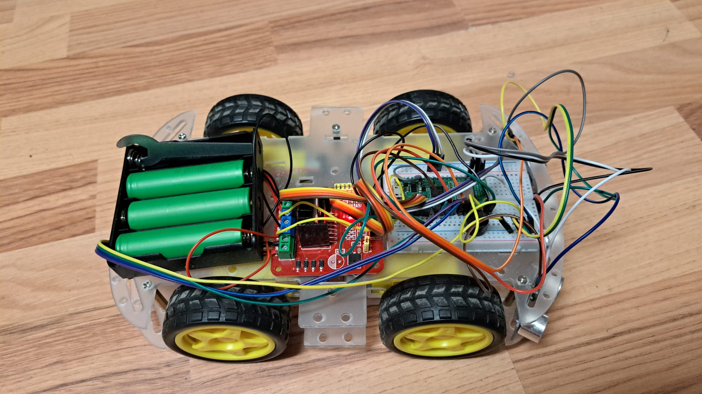

# BOB — Robot 4WD cu Raspberry Pi Pico 2 W

## 1. Descriere generală
BOB este un robot mobil cu tracțiune integrală (4WD) construit pe platforma **Raspberry Pi Pico 2 W**. 
Scopul proiectului a fost dezvoltarea unui sistem autonom și controlabil de la distanță, capabil să evite obstacole, să urmărească un utilizator (Follow-Me) și să fie ghidat folosind un joystick virtual tactil prin intermediul unei interfețe web.

Am dezvoltat software-ul utilizând **Pico C SDK**, punând un accent puternic pe arhitectura multi-core și pe prelucrarea concurentă a datelor de la senzori.

---

## 2. Cerințe funcționale și non-funcționale

### Cerințe funcționale
1. Sistemul permite controlul manual al direcției (înainte, înapoi, stânga, dreapta) folosind o conexiune Bluetooth Low Energy (BLE).
2. Sistemul evită automat obstacolele în modul de deplasare înainte, bazându-se pe 3 senzori ultrasonici (stânga, centru, dreapta) care decid ruta optimă.
3. Sistemul include un mod "Follow-Me" (Distance-Lock Tracking), capabil să mențină o distanță constantă față de un obiect aflat în mișcare (urmărire).
4. Sistemul generează o rețea Wi-Fi (Access Point) și expune o interfață Web prin care utilizatorul poate controla robotul folosind un joystick virtual (prin WebSocket).
5. Sistemul oferă feedback sonor continuu (o melodie redată în fundal folosind timere hardware).
6. Sistemul semnalizează vizual prin intermediul a 3 LED-uri direcția de evitare a obstacolelor sau detectarea utilizatorului.

### Cerințe non-funcționale
1. Răspunsul la comenzile de control (BLE și WiFi) trebuie să fie realizat cu o latență redusă, necesitând rularea serverelor în fundal (interrupt context).
2. Măsurătorile de la senzorii ultrasonici trebuie paralelizate pe un nucleu separat (Core 1) pentru a nu bloca mașina de stări principală a robotului de pe Core 0.
3. Motoarele trebuie controlate progresiv prin semnale PWM diferențiale de 1 kHz, pentru a asigura fluiditatea mișcărilor la viteze mici (evitând pornirile bruște).
4. Citirea senzorilor trebuie să aibă o întârziere minimă de 20ms între măsurători succesive pentru a evita interferențele acustice (cross-talk).

---

## 3. Scenarii de testare

### Scenariul 1: Evitarea obstacolelor în modul manual
Am setat robotul în modul manual (din aplicația BLE) și am trimis comanda continuă de deplasare înainte (`w`). Am plasat obstacole succesiv în fața senzorului central, apoi pe cel din stânga. Sistemul a oprit temporar robotul (frânare), a analizat datele (senzorul cu distanța cea mai mare a indicat direcția liberă) și a pivotat în direcția corectă, aprinzând LED-ul corespunzător.

### Scenariul 2: Urmărirea utilizatorului (Follow-Me)
Am activat modul Follow-Me (`f`). Sistemul a așteptat până când un obiect (utilizatorul) s-a poziționat în fața senzorului central la o distanță între 65cm și 150cm. După preluarea țintei (lock), ne-am deplasat în față, spate și lateral. Robotul a ajustat dinamic PWM-ul motoarelor stânga-dreapta pentru a menține ținta centrată, iar la o distanță mai mică de 65cm s-a oprit automat.

### Scenariul 3: Controlul prin joystick-ul virtual via interfața Web
Am comutat în modul Joystick Web (`g`), ne-am conectat telefonul la AP-ul `BOB-WiFi` și am deschis interfața web la adresa `192.168.4.1`. Am controlat robotul folosind joystick-ul tactil afișat pe ecran. Sistemul a tradus în timp real coordonatele mișcării (transmise prin WebSocket) în semnale PWM proporționale. Timpul de răspuns a fost fluid, iar la ridicarea degetului de pe ecran, motoarele s-au oprit instantaneu.

---

## 4. Arhitectură hardware

### Diagramă bloc hardware


### Schema electrică


### Lista de componente hardware
1. **Raspberry Pi Pico 2 W (Microcontroler)**
2. **Driver Motoare L298N**
3. **4x Motoare DC cu reductor**
4. **3x Senzori Ultrasonici HC-SR04**
5. **3x LED-uri (indicatori stare)**
6. **1x Buzzer Pasiv**
7. **Sursă de alimentare (Baterie 6V-7.4V)**

### Conexiuni hardware

#### 1. Driver motoare L298N
| Pin L298N | Pin Raspberry Pi Pico 2 W | Rol |
|---|---|---|
| IN1 | GP2 | direcție motoare stânga |
| IN2 | GP3 | direcție motoare stânga |
| IN3 | GP4 | direcție motoare dreapta |
| IN4 | GP5 | direcție motoare dreapta |
| ENA | GP14 (PWM7A) | viteză motoare stânga |
| ENB | GP15 (PWM7B) | viteză motoare dreapta |
| OUT1 / OUT2 | motoare stânga | alimentare motoare |
| OUT3 / OUT4 | motoare dreapta | alimentare motoare |
| GND | GND comun | masă comună |

#### 2. Senzori ultrasonici HC-SR04
| Pin HC-SR04 | Pin Raspberry Pi Pico 2 W | Note |
|---|---|---|
| VCC | 3.3V | Protejează pinii de intrare ai Pico |
| GND | GND comun | - |
| TRIG Stânga / ECHO Stânga | GP16 / GP6 | - |
| TRIG Centru / ECHO Centru | GP17 / GP8 | - |
| TRIG Dreapta / ECHO Dreapta | GP18 / GP10 | - |

#### 3. Module suplimentare (LED-uri & Buzzer)
| Componentă | Pin Raspberry Pi Pico 2 W | Rol |
|---|---|---|
| LED Stânga (Anod) | GP7 | Semnalizare obstacol / target stânga |
| LED Centru (Anod) | GP9 | Semnalizare obstacol / target centru |
| LED Dreapta (Anod) | GP11 | Semnalizare obstacol / target dreapta |
| Buzzer Pasiv | GP13 (PWM6B) | Feedback sonor (Jingle Bells) |

*(Notă: Comunicația Wi-Fi și Bluetooth Low Energy sunt asigurate nativ de cipul radio intern CYW43439 de pe Pico 2 W, nefiind necesare module hardware externe precum HC-05).*

---

## 5. Parametrii relevanți ai componentelor

* **Raspberry Pi Pico 2 W:** Microcontroler dual-core ARM Cortex-M33, rulând la 150 MHz. Am integrat cipul radio **CYW43439** pentru comunicațiile Wi-Fi și Bluetooth LE (folosind stiva lwIP și BTstack din SDK). 
  * [Datasheet Pico 2 W](https://datasheets.raspberrypi.com/pico/pico-2-w-datasheet.pdf)
  * [Datasheet RP2350](https://datasheets.raspberrypi.com/rp2350/rp2350-datasheet.pdf)
* **L298N Dual H-Bridge Motor Driver:** Controlează direcția și viteza (prin pinii ENA/ENB conectați la pinii PWM ai Pico). Poate suporta curenți de până la 2A per canal, fiind adecvat pentru cele 4 motoare DC.
  * [Datasheet L298N](https://www.sparkfun.com/datasheets/Robotics/L298_H_Bridge.pdf)
* **HC-SR04 Ultrasonic Sensor:** Folosit pentru detecția distanțelor. O particularitate importantă a implementării noastre este alimentarea senzorilor la **3.3V** pentru a proteja pinii GPIO ai Pico (fără a necesita divizoare rezistive pe pinii ECHO). Intervalul util: 2cm - 400cm.
  * [Datasheet HC-SR04](https://cdn.sparkfun.com/datasheets/Sensors/Proximity/HCSR04.pdf)

---

## 6. Arhitectură software și integrare HW-SW

Am conceput software-ul având la bază o arhitectură concurentă (multi-core), maximizând capabilitățile Pico 2 W.

### Schema bloc software


### Detalii arhitectură:
* **Core 0 (Control Principal):** Rulează mașina de stări (FSM) a robotului cu o frecvență de aproximativ 100 Hz. Acesta se ocupă de:
  * Conexiunea Bluetooth (serviciul Nordic UART - NUS) – rulează în context de întrerupere.
  * Conexiunea Wi-Fi (AP) și serverul HTTP/WebSocket – bazat pe lwIP (threadsafe background).
  * Controlul fizic al motoarelor (semnale PWM calculate din logică de evitare, algoritm Follow-Me sau comenzile de la joystick-ul virtual).
* **Core 1 (Achiziție Senzori):** Rulează exclusiv o buclă de citire continuă pentru cei trei senzori HC-SR04, cu timpi de întârziere pentru prevenirea cross-talk-ului acustic. Datele sunt protejate și comunicate către Core 0 prin **Mutex-uri** (`g_sensor_mutex`), asigurând citiri non-blocante și thread-safe.
* **Control PWM Motoare:** Frecvența de lucru a fost setată precis la **1 kHz** (folosind `pwm_set_clkdiv`), obținând o eficiență mecanică superioară la viteze reduse.
* **Timere Hardware (Buzzer):** Melodia (Jingle Bells) este rulată în fundal folosind funcția `add_alarm_in_ms`, permițând redarea fără a bloca funcționarea celorlalte task-uri. 

---

## 7. Descrierea procesului de testare

Procesul de testare s-a desfășurat în mai multe etape:
1. **Testarea unitară a componentelor (Hardware):** 
   * Am început prin a testa senzorii HC-SR04; în timpul testelor inițiale la 5V, am suprasolicitat anumiți pini (pinii 7, 9, 11). Pentru a corecta eroarea, am alimentat ulterior senzorii la 3.3V și am reconfigurat rutarea hardware-ului pentru a folosi noii pini pentru funcția TRIG, mutând LED-urile pe pinii "parțial funcționali".
2. **Integrarea comunicațiilor (Software):** 
   * Am testat inițial modulul Bluetooth trimițând comenzi UART din aplicația "Serial Bluetooth Terminal", verificând ca răspunsul FSM-ului să se întâmple în sub 50ms.
   * Modulul Wi-Fi a fost verificat independent, asigurându-ne că serverul DHCP emite IP-uri corecte, iar conexiunea WebSocket acceptă pachete text mascate de la browser.
3. **Testarea de sistem (Integrare HW-SW):**
   * Am testat mașina de stări în mediu real. Pentru algoritmul Follow-Me am integrat un filtru de tip "dead-band" (zonă moartă de toleranță de 15 cm) în software, care previne smuciturile și vibrațiile motoarelor la variațiile minore sau eronate ale senzorilor.

---

## 8. Structura proiectului

```text
BOB_CAR/
|-- .vscode/
|-- lhf_web/
|   `-- index.html
|-- CMakeLists.txt
|-- BOB_CAR.c
|-- ble_uart.c / .h
|-- buzzer.c / .h
|-- follow_me.c / .h
|-- motors.c / .h
|-- obstacle.c / .h
|-- sensors.c / .h
`-- wifi_server.c / .h
```

### Module principale:

| Modul | Rol |
|-------|-----|
| **BOB_CAR.c** | Punctul de intrare (main). Conține mașina de stări (FSM) a robotului și inițializarea arhitecturii multi-core. |
| **motors.c** | Controlul motoarelor DC și generarea semnalelor PWM (1 kHz). |
| **sensors.c** | Citirea senzorilor ultrasonici HC-SR04 și controlul LED-urilor (rulează pe Core 1). |
| **ble_uart.c** | Comunicarea Bluetooth Low Energy (stiva BTstack) pentru primirea comenzilor. |
| **wifi_server.c** | Configurarea Access Point-ului Wi-Fi și serverul WebSocket pentru joystick-ul virtual. |
| **obstacle.c** | Algoritmul pentru decizia rutelor libere la întâlnirea obstacolelor. |
| **follow_me.c** | Algoritmul Distance-Lock Tracking pentru urmărirea utilizatorului. |
| **buzzer.c** | Redarea non-blocantă a feedback-ului sonor folosind timere hardware. |

---

## 9. Documentare foto și video

### Video: Prezentare generală și Evitare Obstacole
https://github.tuiasi.ro/user-attachments/assets/586684b1-d8a2-4f5e-af3c-0cc3a6788b6b

### Video: Modul Follow-Me
https://github.tuiasi.ro/user-attachments/assets/73d60fed-a636-4e0b-b3fa-dc61030b71d8

### Video: Interfața Web (Joystick Virtual)
https://github.tuiasi.ro/user-attachments/assets/f384c916-fb1f-4ce0-a292-b8915bdc1a6f


### Poze proiect



